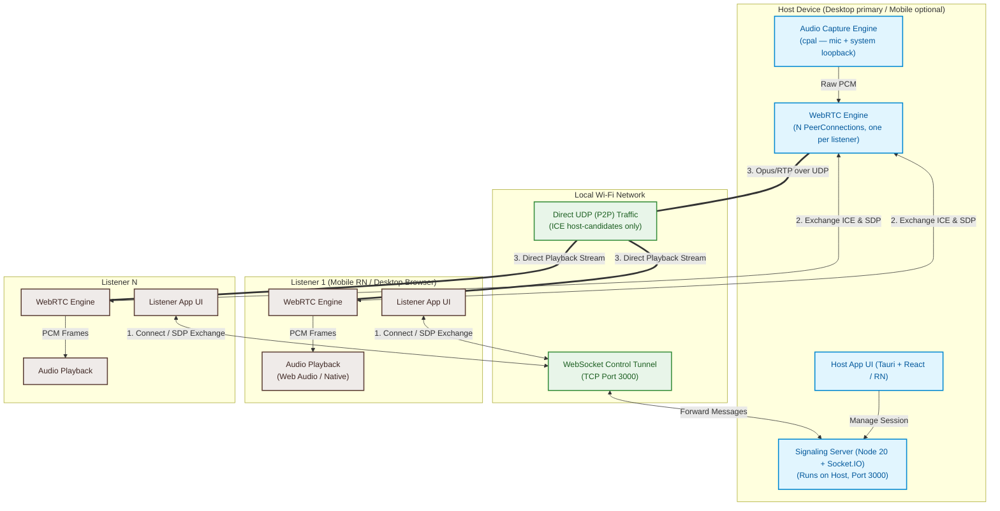

# Wi-Fi-Based Local Audio Broadcasting Platform (SShare)

This document outlines the system architecture, technical design, and implementation plan for **SShare** — an open-source, low-latency, Wi-Fi-based local audio broadcasting platform. A phone or laptop (Host) broadcasts live audio to multiple Listener devices on the same local Wi-Fi network.

---

## System Architecture

Signaling (WebSocket control path) and Media (WebRTC UDP data path) are separated. The signaling server runs **on the Host's desktop machine** — mobile is Listener-first.



---

## Signaling & Media Sequence

```mermaid
sequenceDiagram
    autonumber
    actor Host as Host User
    participant HostApp as Host App (Tauri)
    participant LocalSig as Signaling Server (Node)
    participant Router as Wi-Fi Network
    actor Listener as Listener User
    participant ListApp as Listener App (RN / Browser)

    Host->>HostApp: 1. Launch Host Mode
    HostApp->>LocalSig: 2. Spawn Node signaling server (Port 3000)
    HostApp->>HostApp: 3. Enumerate local IP (prefer RFC1918 on active iface)
    HostApp->>Host: 4. Show session code + QR (ws://192.168.1.50:3000, passcode)

    Listener->>ListApp: 5. Scan QR / Enter IP + code
    ListApp->>Router: 6. Socket.IO connect + passcode
    Router->>LocalSig: 7. Establish signaling channel
    LocalSig->>LocalSig: 8. Verify passcode; reject if wrong
    LocalSig-->>HostApp: 9. Emit 'listener-joined' (socketId)

    HostApp->>HostApp: 10. Create RTCPeerConnection, add audio track
    HostApp->>LocalSig: 11. 'webrtc-offer' (SDP, target=socketId)
    LocalSig->>ListApp: 12. Forward offer
    ListApp->>ListApp: 13. setRemoteDescription, createAnswer
    ListApp->>LocalSig: 14. 'webrtc-answer' (SDP, target=host)
    LocalSig-->>HostApp: 15. Forward answer, setLocalDescription

    par ICE (Host)
        HostApp->>LocalSig: 16. Trickle host-candidates only
        LocalSig->>ListApp: 17. Forward candidate
    and ICE (Listener)
        ListApp->>LocalSig: 18. Trickle host-candidates only
        LocalSig->>HostApp: 19. Forward candidate
    end

    Note over HostApp, ListApp: Direct UDP established over local subnet
    HostApp->>HostApp: 20. Capture PCM (cpal loopback)
    HostApp->>HostApp: 21. Encode Opus (20ms frames, 64kbps)
    HostApp->>Router: 22. RTP over UDP (unicast per listener)
    Router->>ListApp: 23. Deliver RTP
    ListApp->>ListApp: 24. Jitter buffer + PLC
    ListApp->>ListApp: 25. Decode Opus → PCM
    ListApp->>Listener: 26. Playback via Web Audio / native
```

---

## Technology Choices

### 1. Media Transport

| Protocol | Latency | Scalability | Local Compat | Verdict |
| :--- | :--- | :--- | :--- | :--- |
| **WebRTC multi-unicast** | 150-250ms (goal <200ms) | 10-30 listeners | Excellent | **MVP choice** |
| WebSockets + Opus | ~200-350ms | 100+ via relay | Excellent | Fallback for browser-only listeners on strict networks |
| RTP/UDP multicast | <50ms | Unlimited | Poor (routers block/throttle) | Rejected |
| WebRTC via embedded SFU (mediasoup) | 150-250ms | 100+ | Excellent | **Phase 2 scale path** |
| QUIC / WebTransport | <150ms | High | Requires local TLS | Future |

> [!NOTE]
> **Latency budget** — end-to-end target is **<200ms**, not <100ms. Breakdown: capture buffer 10-20ms + Opus frame 20ms + network 5-15ms + jitter buffer 50-100ms + playback buffer 20-40ms. Anything under 150ms requires careful tuning of `AudioContext` latencyHint and Opus frame size.

### 2. Runtime Stack

| Layer | Choice | Why |
| :--- | :--- | :--- |
| Backend runtime | **Node.js 20 LTS** | Widest Tauri sidecar compat, stable Socket.IO 4.x support |
| Package manager | **pnpm 9** (workspaces) | Fast, correct hoisting for RN + Tauri monorepo |
| Language | **TypeScript 5.x** everywhere | Shared types across host/listener/signaling |
| Dev runner | `tsx watch` for backend | Avoids ts-node ESM friction |
| Desktop shell | **Tauri 2** + React | ~10MB installer, Rust backend for `cpal` audio capture |
| Mobile | **React Native (bare / Expo dev-client)** | `react-native-webrtc` needs native modules — **not Expo Go compatible** |
| WebRTC (native) | `react-native-webrtc` | Bypasses browser mixed-content restrictions |
| WebRTC (browser) | Native `RTCPeerConnection` | For desktop listener in Chrome/Firefox |

### 3. Bundling Path (Phase 1.5)

The Node signaling server is launched as a **Tauri sidecar binary** using `pkg` or `@yao-pkg/pkg` to produce a single executable. Phase 3 candidate: rewrite signaling in Rust (`axum` + `socketioxide`) to drop the ~40MB Node runtime.

---

## Repository Layout

Monorepo at `D:\SShare` using pnpm workspaces.

```
SShare/
├── package.json              # workspace root, dev scripts
├── pnpm-workspace.yaml       # workspace glob
├── .nvmrc                    # 20
├── tsconfig.base.json        # shared TS config
├── backend/
│   ├── package.json
│   ├── src/
│   │   ├── server.ts         # Express + Socket.IO entry
│   │   ├── session.ts        # session/passcode logic
│   │   ├── signaling.ts      # SDP/ICE relay handlers
│   │   └── types.ts          # re-exports from shared/
│   └── test/
│       └── signaling.test.ts # headless socket.io client tests (Vitest)
├── desktop/
│   ├── package.json
│   ├── src/                  # React UI
│   ├── src-tauri/
│   │   ├── tauri.conf.json
│   │   ├── Cargo.toml
│   │   └── src/
│   │       ├── main.rs
│   │       ├── audio.rs      # cpal capture (mic + loopback)
│   │       └── sidecar.rs    # spawn Node signaling server
│   └── binaries/             # bundled Node signaling exe (per-arch)
├── mobile/
│   ├── package.json
│   ├── app.json              # Expo config (bare / dev-client)
│   ├── App.tsx
│   └── src/
│       ├── screens/
│       └── webrtc/           # react-native-webrtc glue
└── shared/
    ├── package.json
    ├── src/
    │   ├── events.ts         # Socket.IO event names + payloads
    │   ├── qr.ts             # QR schema + version
    │   └── index.ts
```

### Root `package.json` scripts

```json
{
  "scripts": {
    "dev:backend": "pnpm --filter backend dev",
    "dev:desktop": "pnpm --filter desktop tauri:dev",
    "dev:mobile":  "pnpm --filter mobile start",
    "build":       "pnpm -r build",
    "test":        "pnpm -r test",
    "typecheck":   "pnpm -r typecheck"
  }
}
```

### `pnpm-workspace.yaml`

```yaml
packages:
  - backend
  - desktop
  - mobile
  - shared
```

---

## Signaling API

### Socket.IO Events

| Event | Direction | Payload | Notes |
| :--- | :--- | :--- | :--- |
| `create-session` | host → server | `{ passcode, hostName }` | Server returns `{ sessionCode, hostSocketId }` |
| `join-session` | listener → server | `{ sessionCode, passcode, listenerName }` | Rejected on wrong passcode |
| `listener-joined` | server → host | `{ socketId, listenerName }` | Trigger host to create PeerConnection |
| `listener-left` | server → host | `{ socketId, reason }` | Disconnect or explicit leave |
| `webrtc-offer` | host → server → listener | `{ target, sdp }` | Server relays to `target` socket |
| `webrtc-answer` | listener → server → host | `{ target, sdp }` | |
| `ice-candidate` | peer → server → peer | `{ target, candidate }` | Host-candidates only in MVP |
| `session-ended` | host → server → all | `{ reason }` | Server force-disconnects listeners |
| `host-ip-changed` | host → server → all | `{ newIp }` | Roaming / DHCP renew — listeners reconnect |

### QR Code Schema (versioned)

```json
{
  "v": 1,
  "ip": "192.168.1.45",
  "port": 3000,
  "code": "SS-8742",
  "protocol": "ws",
  "requiresPasscode": true
}
```

Listeners refusing unknown `v` fall back to a "please update" screen.

---

## Security

1. **Passcode is default-on**. Session codes alone (`SS-####`) are guessable on an open café Wi-Fi — a 6-digit passcode raises the bar to ~1M guesses per session. Passcode is embedded in the QR (users who scan get in silently; typed-in listeners must enter it).
2. **Client Isolation detection**: on connect, host and listener attempt a UDP probe to each other's advertised IP. Failure surfaces a clear error: *"Your Wi-Fi blocks device-to-device traffic. Try a mobile hotspot."*
3. **No external STUN/TURN by default**. Local host-candidates only — traffic never leaves the LAN.
4. **Optional local TURN fallback** (Phase 2): bundle `coturn` as an opt-in sidecar for guest-VLAN / isolated networks.
5. **Rate limit** join attempts per IP on the signaling server (5/min) to blunt passcode brute force.

---

## Open Questions Resolved

- **System audio capture on mobile** — Desktop host is primary. Mobile host supports **microphone only** for MVP; Android `MediaProjection` deferred to Phase 2.
- **mDNS discovery** — Not in MVP. QR + manual IP only. mDNS added in Phase 2 with a "some routers block this" warning.
- **Listener surfaces at MVP** — Mobile RN app (via `react-native-webrtc`) and **desktop browser via `http://<host-ip>:3000`** (browsers permit `ws://` and `getUserMedia`-free WebRTC receive on plain HTTP from RFC1918 addresses). A native desktop listener is Phase 2.
- **IP roaming** — If the host's IP changes mid-session, host emits `host-ip-changed`; listeners reconnect with the new IP. If reconnect fails within 10s, session ends cleanly.

---

## Verification & Testing

### Automated

- **Signaling handshake** (`backend/test/signaling.test.ts`): boot the server on a random port, connect two headless `socket.io-client` instances, assert full offer/answer/ICE relay lifecycle including passcode rejection and `listener-left` on disconnect. Runs in CI with Vitest.
- **QR schema round-trip** (`shared/test/qr.test.ts`): encode → decode → assert version guard.
- **Type-check gate**: `pnpm typecheck` on all workspaces.

### Manual / Semi-automated Latency

- **Loopback cross-correlation**: play a 1kHz chirp on the host, record the listener's output through a loopback cable, cross-correlate the two signals to compute end-to-end delay. Script lives in `scripts/latency.mjs`. Target: **<200ms P50, <300ms P95** over 5 minutes.
- **3-listener soak**: 1 host + 3 listeners on the same AP for 30 minutes; assert no audio dropout, clean teardown on host quit, and correct reconnect behavior after listener Wi-Fi toggle.

### Manual Smoke

1. `pnpm dev:backend` — server logs `listening on :3000`.
2. `pnpm dev:desktop` — Tauri window opens, host mode shows QR.
3. Second machine's Chrome → scan QR → audio plays.
4. Kill host — listener shows "session ended" within 2s.

---

## Rollout Phases

| Phase | Scope |
| :--- | :--- |
| **MVP (P1)** | Desktop host (Tauri), RN listener, browser listener, passcode auth, QR onboarding |
| **P2** | Embedded SFU (mediasoup) for 30+ listeners, optional coturn, mDNS discovery, mobile host (mic only) |
| **P3** | Rust-native signaling (drop Node sidecar), Android `MediaProjection`, WebTransport experiment |
